# Oh hi! 🪶✨ This is shrimp2845 

## About Me

Taiwanese high schooler and programming enthusiast.

## Passionate about......

**coding**:
I only know Python QAQ

**cryptography**: 
I had studied how AES, DES, RSA, RC4 worked, and the basic math knowledge (groups, rings, fields, Modular Arithmetic.....etc)

**chess**:
chess.com peak rapid elo 1792

**ACGN**:
恋愛小説の愛好家
recent:

["お隣の天使様にいつの間にか駄目人間にされていた件"](https://otonarino-tenshisama.jp/)

["転校先の清楚可憐な美少女が、昔男子と思って一緒に遊んだ幼馴染だった件"](https://tenbin-anime.asmik-ace.co.jp/)

["クラスで2番目に可愛い女の子と友だちになった"](https://kuranika.asmik-ace.co.jp/)

["愛してるゲームを終わらせたい"](https://www.aishiteru-game.com/)

Mumei is my oshi btw

## Stats

 

[blog](https://shrimp2845-tw.github.io/) | [email](mailto:goldencheng15@gmail.com) | [ig](https://www.instagram.com/shrimp2845?igsh=MWI2OW12NHc2cXBkMQ==) | [chess.com](https://www.chess.com/member/shrimp2847)
